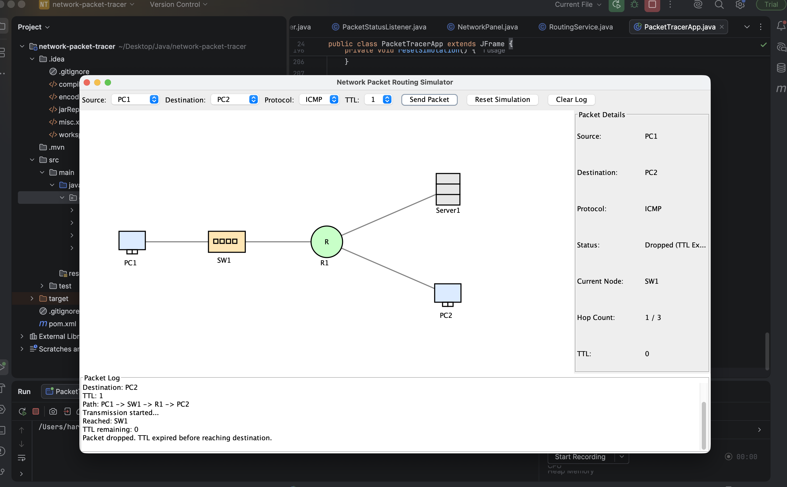

# network-packet-routing-simulator-javaswing

# Network Packet Routing Simulator using Java Swing

A Java Swing-based desktop application that simulates packet routing across a small computer network. The project demonstrates networking concepts such as packet transmission, routing path discovery, hop count, TTL handling, protocol flow, and packet delivery/drop status through an interactive GUI.



---

## Project Overview

This project is designed to visually demonstrate how a packet travels from a source device to a destination device in a network topology. The user can select the source node, destination node, protocol type, and TTL value. Based on the selected input, the application finds a valid route, animates the packet movement, logs each hop, and updates the packet status in real time.

The project is useful for understanding basic networking concepts such as:

- Packet routing
- Network topology
- Source and destination communication
- Hop-by-hop packet movement
- TTL expiry
- Protocol-based packet flow
- Packet delivery and packet drop conditions

---

## Features

- Interactive Java Swing-based desktop GUI
- Visual network topology with PCs, switch, router, and server
- Source and destination node selection
- Protocol selection for ICMP, TCP, and UDP
- TTL-based packet handling
- Packet movement animation across network links
- Route/path discovery between selected nodes
- Packet status tracking:
  - Created
  - In Transit
  - Delivered
  - Dropped due to TTL expiry
  - No Route
- Real-time packet log panel
- Packet details panel showing:
  - Source
  - Destination
  - Protocol
  - Current status
  - Current node
  - Hop count
  - Remaining TTL
- Reset simulation and clear log options

---

## Technologies Used

- Java
- Java Swing
- Maven
- Object-Oriented Programming
- Basic Networking Concepts
- Graph Traversal / BFS-based Routing Logic

---

## Network Topology

The simulator uses a sample network topology containing:

- PC1
- Switch
- Router
- Server
- PC2

Example route:

```text
PC1 -> SW1 -> R1 -> Server1
```

The packet moves from one node to another based on the available links in the topology.

---

## How It Works

1. The user selects a source device.
2. The user selects a destination device.
3. The user selects a protocol: ICMP, TCP, or UDP.
4. The user selects a TTL value.
5. The application searches for a valid route between the selected nodes.
6. If a route exists, the packet starts moving through the path.
7. After each hop, TTL is reduced.
8. If the packet reaches the destination before TTL expires, the status becomes `Delivered`.
9. If TTL expires before reaching the destination, the status becomes `Dropped (TTL Expired)`.
10. The packet log records each step of the simulation.

---

## Project Structure

```text
network-packet-routing-simulator-javaswing/
│
├── README.md
├── Screenshot.png
│
└── network-packet-tracer/
    │
    ├── pom.xml
    │
    └── src/
        └── main/
            └── java/
                └── com/
                    └── example/
                        └── packettracer/
                            │
                            ├── PacketTracerApp.java
                            │
                            ├── model/
                            │   ├── Node.java
                            │   ├── Link.java
                            │   └── Packet.java
                            │
                            ├── service/
                            │   └── RoutingService.java
                            │
                            ├── ui/
                            │   └── NetworkPanel.java
                            │
                            └── util/
                                ├── PacketLogger.java
                                └── PacketStatusListener.java
```

---

## Main Components

### PacketTracerApp.java

This is the main application class. It creates the GUI, handles user input, displays packet logs, and updates packet details during the simulation.

### NetworkPanel.java

This class manages the network topology visualization, packet animation, node drawing, link drawing, and packet movement between nodes.

### RoutingService.java

This class contains the routing logic. It finds a valid path between the source and destination nodes using graph traversal concepts.

### Model Classes

The model package contains classes representing core network objects:

- `Node` - represents a network device
- `Link` - represents a connection between two nodes
- `Packet` - represents a packet being transmitted

### Utility Classes

The utility package contains helper interfaces/classes used for logging and updating packet status during simulation.

---

## How to Run the Project

### Prerequisites

Make sure the following are installed:

- Java JDK 17 or above
- Maven
- Any Java IDE such as IntelliJ IDEA, Eclipse, or VS Code

---

### Steps to Run

1. Clone the repository:

```bash
git clone https://github.com/Harshada42/network-packet-routing-simulator-javaswing.git
```

2. Go to the project directory:

```bash
cd network-packet-routing-simulator-javaswing/network-packet-tracer
```

3. Compile the project:

```bash
mvn clean compile
```

4. Run the main class from your IDE:

```text
com.example.packettracer.PacketTracerApp
```

You can also run it using Maven:

```bash
mvn exec:java -Dexec.mainClass="com.example.packettracer.PacketTracerApp"
```

---

## Example Use Case

Example input:

```text
Source: PC1
Destination: Server1
Protocol: ICMP
TTL: 4
```

Expected behavior:

```text
Packet created
Protocol: ICMP
Source: PC1
Destination: Server1
Path: PC1 -> SW1 -> R1 -> Server1
Transmission started...
Reached: SW1
TTL remaining: 3
Reached: R1
TTL remaining: 2
Reached: Server1
Packet delivered successfully.
```

---

## TTL Handling Example

If the selected TTL is too low, the packet will be dropped before reaching the destination.

Example:

```text
Source: PC1
Destination: Server1
TTL: 1
```

Expected result:

```text
Packet dropped. TTL expired before reaching destination.
```

This demonstrates how TTL prevents packets from circulating endlessly in a network.

---

## Learning Outcomes

Through this project, the following concepts are demonstrated:

- Java desktop application development
- Java Swing GUI design
- Event handling in Java
- Object-oriented design
- Network topology representation
- Packet routing simulation
- TTL-based packet drop logic
- Protocol-based packet visualization
- Graph traversal for route discovery
- Modular project structure using model, service, UI, and utility layers

---

## Future Enhancements

Possible improvements for this project:

- Add custom topology creation
- Allow users to add/remove nodes and links
- Add support for more protocols
- Add shortest path cost/weight calculation
- Add packet loss simulation
- Add firewall/security rule simulation
- Add multiple packet transmission
- Add exportable packet logs
- Improve UI with icons and better layout
- Add unit tests for routing logic


